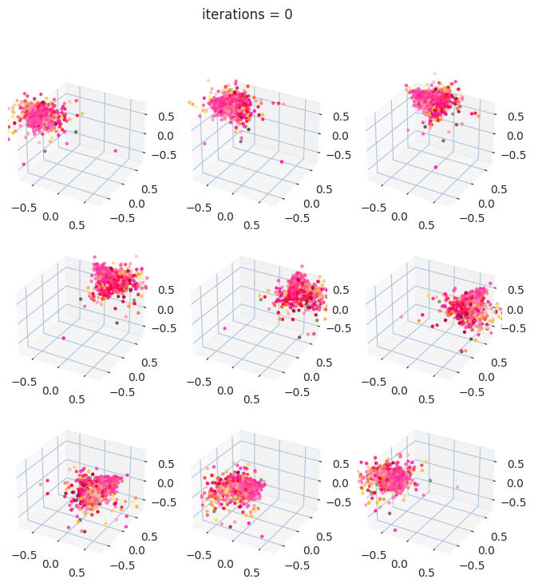

# Indoor scene generation using Point-E and Training Free Layout Control

Authors: *Luyang Busser, Alessia Hu, Oline Ranum, Luc Sträter, Sina Taslimi, Miranda Zhou*

This repository contains code and blogpost on the reproduction and extension of [Point-E: A System for Generating 3D Point Clouds from Complex Prompts](https://arxiv.org/abs/2212.08751), 2022. We present framework for extending point cloud diffusion models to accomodate indoor scene generations directly from text prompts. The framework is able to produce small scenes composed of 2-3 furnitures. For an in-depth discussion of our work, see the paper.

<p align="center">
    
   <br>
   <text><em>Animation of four 3D point clouds diffusing.</em></text>
</p>

The official code and model release for Point-E can be found at [Point-E: A System for Generating 3D Point Clouds from Complex Prompts](https://github.com/openai/point-e).

The official code and model release for Training Free layout control can be found at [Training-Free Layout Control with Cross-Attention Guidance](https://github.com/silent-chen/layout-guidance).

## Code structure

| Directory | Description |
| --------- | ----------- |
| `demos/` | Notebooks used to analyze training runs, results and render scenes. |
| `src/layout_guidance` | Source code used for Training-Free Layout Control with Cross-Attention Guidance. Adapted from the [repo of the original paper](https://github.com/silent-chen/layout-guidance). |
| `src/point_e` | Source code used for point-e point cloud diffusion. Adapted from the [repo of the original paper](https://github.com/openai/point-e). |
| `src/imgs/` | Location where produced images are stored. |
| `src/imgs/results/` | Location where all the pre-produced results are stored. |
| `src/scripts/` | Files to run that reproduce the results. |
| `paper.pdf` | Report introducing original work, discussing our novel contribution and analaysis. |


# Usage

First, install the conda environment 
```shell
conda create -n isg python=3.8
conda activate isg

pip install -r requirements.txt
```

# Demonstrations

To get started with examples, see the following notebooks:

 * [Demo_Text2PointCloud.ipynb](demos/Demo_Text2PointCloud.ipynb) - try the text-to-3D model to produce 3D point clouds directly from text descriptions, using either Stable Diffusion or GLIDE backbone. 
 * [2D_Attention_Analysis.ipynb](demos/2D_Attention_Analysis.ipynb) - try the 2D attention map tools for training-free layout guidance with a Stable Diffusion backbone
 * [3D_Attention_Analysis.ipynb](demos/3D_Attention_Analysis.ipynb) - try the 3D attention map tools for evaluation attention in point cloud diffusion with point-E
 * [3D_Attention_CLIP.ipynb](demos/3D_Attention_CLIP.ipynb) - try the 3D attention map tools for evaluation the cross-attention associated with the CLIP image embeddings in point cloud diffusion with point-E

 
# Samples

You can download the seed images and point clouds corresponding to the paper banner images of point-E [here](https://openaipublic.azureedge.net/main/point-e/banner_pcs.zip).
